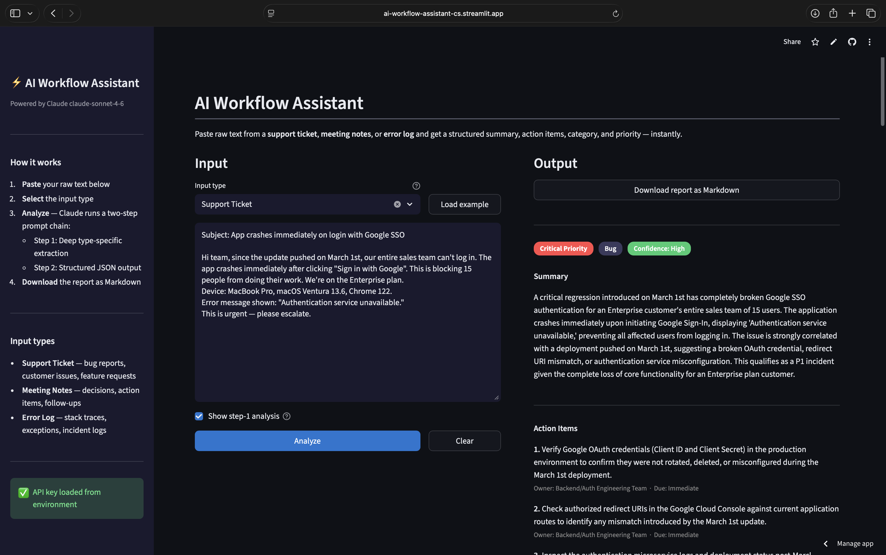

# AI Workflow Assistant

A portfolio project demonstrating AI automation engineering skills using the **Anthropic Claude API** and **Streamlit**.

Paste raw unstructured text — a support ticket, meeting notes, or an error log — and get back a clean, structured report with a summary, action items, category, and priority level. The report is viewable in the UI and downloadable as Markdown.

---

## Demo



---

## Features

| Feature | Detail |
|---|---|
| **Three input types** | Support tickets, meeting notes, error logs |
| **Two-step prompt chain** | Step 1 extracts deep analysis; Step 2 structures it as JSON |
| **Structured output** | Summary, action items (with owner + due date), category, priority, key details |
| **Confidence scoring** | Claude rates its own output quality given the input |
| **Markdown export** | Download the full report as a `.md` file |
| **Transparent reasoning** | Toggle to show the step-1 analysis in the UI |

---

## Architecture

```
app.py          ← Streamlit UI (input, output panels, download button)
processor.py    ← Prompt chain orchestration (two Claude API calls)
prompts.py      ← All prompt templates (extraction + structuring)
utils.py        ← JSON parsing, markdown rendering, download helpers
```

### Prompt chain

```
Raw text
   │
   ▼
[Step 1 — Extract]
  Type-specific prompt (support ticket / meeting notes / error log)
  → Deep analysis as free-form text
   │
   ▼
[Step 2 — Structure]
  Universal structuring prompt
  → Strict JSON: summary, category, priority, action_items, key_details, confidence
   │
   ▼
Streamlit UI renders result + offers Markdown download
```

The two-step design produces better results than a single prompt because Claude can reason freely in step 1 without the cognitive overhead of formatting constraints.

---

## Setup

### 1. Clone and install

```bash
git clone https://github.com/yourname/ai-workflow-assistant.git
cd ai-workflow-assistant
python -m venv .venv
source .venv/bin/activate      # Windows: .venv\Scripts\activate
pip install -r requirements.txt
```

### 2. Configure your API key

```bash
cp .env.example .env
# Edit .env and set ANTHROPIC_API_KEY=sk-ant-...
```

You can also enter the key directly in the sidebar at runtime (useful for demos).

### 3. Run

```bash
streamlit run app.py
```

Open [http://localhost:8501](http://localhost:8501) in your browser.

---

## Usage

1. Select an input type from the dropdown
2. Paste your raw text into the input panel
3. Click **Analyze**
4. View the structured results in the output panel
5. Optionally enable **Show step-1 analysis** to see Claude's reasoning
6. Click **Download report as Markdown** to save the report

---

## Example inputs

<details>
<summary>Support ticket</summary>

```
Subject: App crashes immediately on login with Google SSO

Hi team, since the update pushed on March 1st, our entire sales team can't log in.
The app crashes immediately after clicking "Sign in with Google". This is blocking
15 people from doing their work. We're on the Enterprise plan. Device: MacBook Pro,
macOS Ventura 13.6, Chrome 122. Error message shown: "Authentication service unavailable."
This is urgent — please escalate.
```

</details>

<details>
<summary>Meeting notes</summary>

```
Sprint Planning — Q1 Week 9
Attendees: Sarah (PM), Dev (Engineering lead), Priya, Tom, Marcus

Discussed last sprint's velocity (42 points, target was 50). Tom flagged the auth
service is still flaky — agreed to spike on it Monday. Sarah confirmed the mobile
launch date is locked: April 14th. Priya will own the push notification work and
needs designs from the UX team by EOD Thursday. Marcus volunteered to write the
deployment runbook by next Friday. Open question: do we need a feature flag for
the new onboarding flow? Decision deferred to async Slack thread.
```

</details>

<details>
<summary>Error log</summary>

```
[CRITICAL] 2024-03-04 09:17:43 UTC — PaymentService
java.lang.NullPointerException: Cannot invoke "com.example.Payment.getAmount()" because "payment" is null
    at com.example.PaymentService.processCharge(PaymentService.java:214)
    at com.example.OrderController.checkout(OrderController.java:88)
    at sun.reflect.NativeMethodAccessorImpl.invoke0(Native Method)
Caused by: Database timeout after 30000ms — connection pool exhausted (pool size: 10/10)
Request context: user_id=84291, order_id=ORD-20240304-8841, amount=$349.00
Last successful transaction: 09:12:01 UTC
```

</details>

---

## Tech stack

- **[Anthropic Python SDK](https://github.com/anthropics/anthropic-sdk-python)** — Claude claude-sonnet-4-6
- **[Streamlit](https://streamlit.io)** — UI framework
- **[python-dotenv](https://pypi.org/project/python-dotenv/)** — Environment variable management

---

## License

MIT
